# Projet *Bruine* : Conception V 1.0

## 1. Table des matières

- [1. Table des matières](#1-table-des-matières)
- [2. Objectif du document](#2-objectif-du-document)
- [3. Architecture](#3-architecture)
    - [3.1. Choix des technologies](#31-choix-des-technologies)
        - [3.1.1. Administration du système](#311-administration-du-système)
        - [3.1.2. Utilisateurs Steam](#312-utilisateurs-steam)
    - [3.2. Contraintes techniques](#32-contraintes-techniques)
- [4. Technologies utilisées](#4-technologies-utilisées)
    - [4.1. Serveur web](#41-serveur-web)
    - [4.2. Stockage des données](#42-stockage-des-données)
    - [4.3. Couche de persistance](#43-couche-de-persistance)
    - [4.4. Couche métier](#44-couche-métier)
    - [4.5. Couche service](#45-couche-service)
    - [4.6. Couche présentation](#46-couche-présentation)
    - [4.7. Authentification](#47-authentification)
    - [4.8. Sécurité](#48-sécurité)
    - [4.9. Environnement de développement](#49-environnement-de-développement)
    - [4.10. Tests unitaires](#410-tests-unitaires)
    - [4.11. Packages et dépendances](#411-packages-et-dépendances)
    - [4.12. Déploiement](#412-déploiement)
- [5. Préliminaire à la conception](#5-préliminaire-à-la-conception)
    - [5.1. Modèle d'inventaire : copie physique ou compteur ?](#51-modèle-dinventaire--copie-physique-ou-compteur-)
- [6. Cas d'utilisation](#6-cas-dutilisation)
    - [6.1. Rappel : modèle de données](#61-rappel--modèle-de-données)
    - [6.2. Sous-domaine : système gacha](#62-sous-domaine--système-gacha)
        - [6.2.1. Tirer des cartes](#621-tirer-des-cartes)
        - [6.2.2. Convertir des cartes en XP](#622-convertir-des-cartes-en-xp)
    - [6.3. Sous-domaine : marché entre joueurs](#63-sous-domaine--marché-entre-joueurs)
        - [6.3.1. Mettre une carte en vente](#631-mettre-une-carte-en-vente)
        - [6.3.2. Acheter une carte](#632-acheter-une-carte)
- [7. Regroupement des classes](#7-regroupement-des-classes)
    - [7.1. Groupe domaine Steam](#71-groupe-domaine-steam)
    - [7.2. Groupe gacha](#72-groupe-gacha)
    - [7.3. Groupe marché](#73-groupe-marché)
    - [7.4. Groupe interface utilisateur](#74-groupe-interface-utilisateur)
- [8. Choix et remarques](#8-choix-et-remarques)
    - [8.1. Isolation des sessions admin et Steam](#81-isolation-des-sessions-admin-et-steam)
    - [8.2. Gestion des associations paresseuses (LazyInit)](#82-gestion-des-associations-paresseuses-lazyinit)
    - [8.3. Protection des cartes dans le deck](#83-protection-des-cartes-dans-le-deck)
    - [8.4. Limites du modèle et points d'attention](#84-limites-du-modèle-et-points-dattention)
- [9. Annexes](#9-annexes)
    - [9.1. Terminologie](#91-terminologie)

---

## 2. Objectif du document

Ce document aborde l'architecture, la conception et les choix techniques pour l'implémentation du projet **Bruine**,
une application web de gamification Steam. Les utilisateurs s'authentifient via Steam OpenID et peuvent tirer des cartes
à collectionner (système gacha), constituer un deck, convertir leurs doublons en points d'expérience, et échanger des
cartes sur un marché entre joueurs.

---

## 3. Architecture

### 3.1. Choix des technologies

Le projet cible deux profils d'utilisateurs distincts admin et steamUser.

#### 3.1.1. Administration du système

- Il s'agit essentiellement de CRUD : gestion des comptes admin, des joueurs, et des récompenses gacha ;
- la sécurité doit être forte et isolée du reste de l'application ;
- le dashboard sera une interface web classique.

J'ai choisi de traiter l'administration dans la même application Spring Boot, derrière une chaîne de sécurité dédiée
(`@Order(1)`), avec une clé de session séparée (`ADMIN_SECURITY_CONTEXT`) pour garantir l'isolation vis-à-vis des
sessions joueurs. Tout en permettant à l'admin d'être connecté en même temps qu'un compte Steam pour tester les
fonctionnalités. La déconnexion de l'admin n'affectera pas la session Steam, et inversement.

#### 3.1.2. Utilisateurs Steam

- l'authentification est déléguée entièrement à Steam via le protocole OpenID 2.0, on ne gère pas de mot de passe ;

Un site web avec Thymeleaf pour le rendu côté serveur, complété de JavaScript pour les interactions
dynamiques, répond à tous ces besoins sans surcharger l'architecture.

### 3.2. Contraintes techniques

- L'application doit être accessible de l'extérieur pour que Steam puisse rappeler le serveur lors de l'authentification
  OpenID (callback) ;
- l'accès à l'API Steam nécessite une clé d'API valide (`steam.token`), configurée dans `application.properties` (à
  terme il faut stocker cette clé dans le Service Variables de Railway pour éviter de la versionner) ;
- Spring Boot / JPA / Thymeleaf, choix cohérent avec les compétences vue en GLG203 que je souhaite utiliser ici;
- le déploiement cible Railway (PaaS), la license microsoft "Azure for student" me posant des problèmes pour la création
  de la BDD (même si j'ai réussi à mettre en place un CI/CD, la bdd reste un point bloquant) ;

---

## 4. Technologies utilisées

### 4.1. Serveur web

**Spring Boot 3.5**, framework Java d'application web autonome basé sur Spring Framework 6.x.

- il embarque un serveur Tomcat directement dans le JAR produit, éliminant le besoin d'un conteneur de servlets externe.
- Il repose sur le principe de *convention over configuration* : Spring MVC, JPA, Security et Thymeleaf sont
  auto-configurés selon les dépendances présentes sur le classpath, ce qui couvre l'intégralité du périmètre de ce
  projet sans bibliothèque tierce supplémentaire.
- Sa principale force est l'intégration native de tout l'écosystème Spring et un déploiement simplifié (notamment avec
  Railway), au prix d'une consommation mémoire supérieure aux frameworks légers comme Quarkus ou Micronaut.
- Le coût d'adoption est quasi nul, Spring Boot est le framework utilisé en GLG203, les bases sont déjà acquises.
- Son modèle de déploiement s'intègre directement avec Railway, qui détecte et build automatiquement le projet depuis
  GitHub.

### 4.2. Stockage des données

Les données seront stockées dans une base **MySQL 9.4** (local & prod), hébergée comme service dédié sur Railway. Les
migrations de schéma seront gérées par **Flyway**, ce qui garantira la reproductibilité de l'environnement entre le
développement local (Docker Compose) et la production (Railway).

- Il est à noter que la version **MySQl 9.4** provoque le warning suivants "Flyway upgrade recommended: MySQL 9.4 is
  newer than this version of Flyway and support has not been tested. The latest supported version of MySQL is 8.1."

### 4.3. Couche de persistance

La couche de persistance reposera sur Hibernate via Spring Data JPA, tous deux gérés par le BOM de Spring Boot

- Les accès à la base de données passeront par des interfaces
  `Repository` (pattern *Repository*, issu du **Domain Driven Design**) : Spring Data génère l'implémentation à
  partir des signatures de méthode ou d'annotations `@Query`.
- Le driver JDBC utilisé est `mysql-connector-j` (version gérée par le BOM). Les opérations transactionnelles complexes
  utiliseront des requêtes JPQL annotées `@Query`.

### 4.4. Couche métier

Les entités JPA porteront les données métier (`SteamUser`, `GachaReward`, `UserGachaReward`, `Deck`, `MarketListing`).
La logique métier complexe, vérification des règles de vente, calcul d'XP, tirage aléatoire pondéré, sera encapsulée
dans des classes `@Service` dédiées par module.

- Les entités utilisent Lombok (@Data, @NoArgsConstructor) pour éliminer le boilerplate getters/setters

### 4.5. Couche service

Chaque module exposera une façade `@Service` : `GachaRewardService`, `MarketService`, `DeckService`,
`SteamUserService`. Ces services seront le seul point d'entrée pour les contrôleurs ; ils cacheront les détails des
repositories et concentreront les règles métier (validations, transactions).

### 4.6. Couche présentation

La couche de présentation combinera **Spring MVC** (contrôleurs `@Controller`) et **Thymeleaf** pour le rendu HTML
côté serveur. Les interactions dynamiques (tirage gacha, conversion de cartes) utiliseront du JavaScript natif et
communiqueront en **JSON** avec des endpoints `@ResponseBody`. Le CSS s'appuiera sur **Bulma** (via WebJars) et
**Font Awesome** pour les icônes.

### 4.7. Authentification

L'authentification des joueurs utilisera **Steam OpenID 2.0** : le joueur sera redirigé vers Steam, qui renverra
l'identifiant vérifié (`steamId`). Côté admin, l'authentification reposera sur `DaoAuthenticationProvider` avec les
mots de passe stockés en base via le `DelegatingPasswordEncoder` de Spring Security.

### 4.8. Sécurité

**Spring Security** gérera trois chaînes de filtres isolées (`@Order`) :

| Priorité | Chaîne                  | URLs                  | Mécanisme                                                                     |
|----------|-------------------------|-----------------------|-------------------------------------------------------------------------------|
| 1        | `adminFilterChain`      | `/admin`, `/admin/**` | DaoAuthenticationProvider, rôle `ROLE_ADMIN`                                  |
| 2        | `deckWidgetFilterChain` | `/deck/7656119*`      | Accès public sans auth, `X-Frame-Options` désactivé pour l'intégration iframe |
| 3        | `mainFilterChain`       | Tout le reste         | SteamAuthenticationProvider, rôle `ROLE_USER`                                 |

Deux rôles, mais trois chaînes parce que le widget deck a des contraintes HTTP spécifiques (autoriser l'embedding) qui
ne peuvent pas cohabiter avec les headers de sécurité de la chaîne principale.

### 4.9. Environnement de développement

- Gradle gère la compilation, les dépendances et le packaging.
- Pour l'IDE, IntelliJ IDEA Ultimate (pour l'accès aux plugins Spring très poussés).
- En développement local, la base de données sera fournie via **Docker Compose** (`docker compose up -d`).
- **Lombok** sera utilisé pour réduire le code de type *boilerplate* (getters, setters, constructeurs).

### 4.10. Tests unitaires

Les tests utiliseront **JUnit 5** via Spring Boot Test. Je couvrirai en priorité la logique métier sensible : calcul
d'XP, tirage pondéré des rarités et finitions, et règles de validation du marché.

### 4.11. Packages et dépendances

L'approche par modules fonctionnels donnera les composants suivants :

- `steam` : authentification Steam OpenID, profils utilisateurs, classements ;
- `gacha` : tirage de cartes, inventaire, conversion en XP ;
- `deck` : constitution et affichage du deck de cartes ;
- `market` : marché d'échange de cartes entre joueurs ;
- `admin` : back-office de gestion ;
- `config` : configuration Spring Security, MVC, etc.

Chaque module suit la même **architecture par couche** : `model` → `repository` → `service` → `ui` (contrôleurs).
Les modules étant indépendants et auto-suffisants, on parle également d'**architecture en silo**.

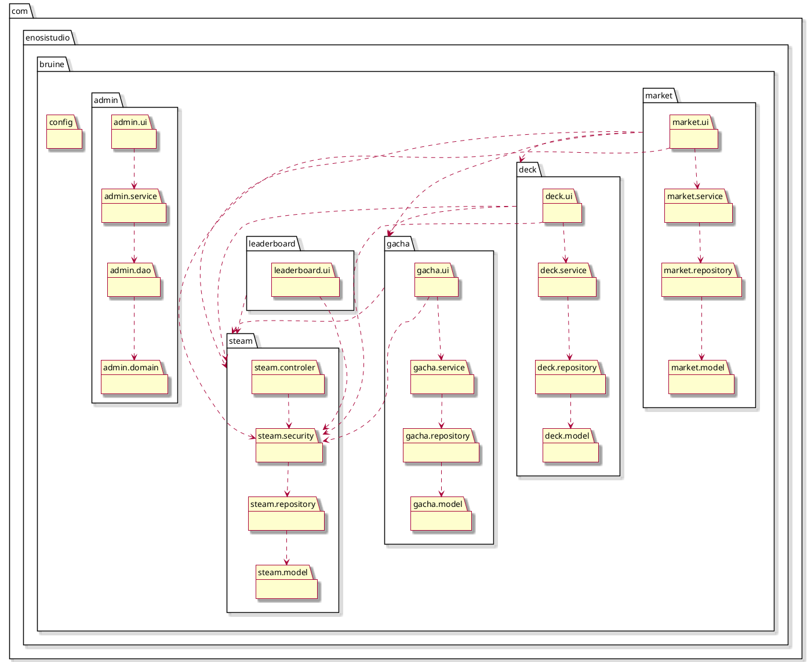

### 4.12. Déploiement

L'application sera déployée sur **Railway** (PaaS) car très simple d'utilisation + CI/CD + gratuit pdt 1 mois.

Déployée via trois services interconnectés dans l'interface Railway :

- **Service applicatif** : Railway détecte automatiquement le projet Java Spring Boot depuis le dépôt GitHub et
  assure le build et le déploiement continu (CI/CD). Aucun Dockerfile n'est nécessaire en prod.
- **Service MySQL** : base de données managée par Railway, accessible en interne uniquement via les variables
  d'environnement injectées automatiquement.
- **Service phpMyAdmin** : interface d'administration de la base de données en production, utile pour le debug
  et l'observation des données. Ce service est désactivé en dehors des phases de développement actif.

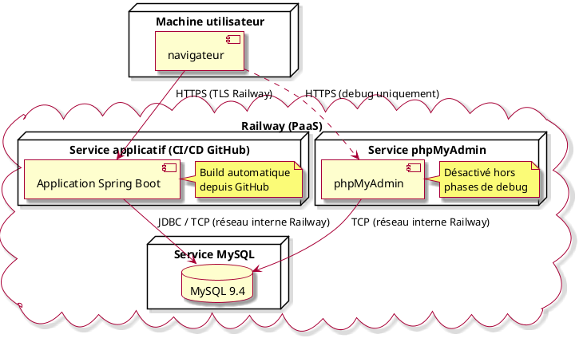

- La base de données n'est pas exposée à l'extérieur ; seuls les services Railway du même projet y ont accès ;
- Railway gérera les certificats pour chaque service exposé automatiquement ;
- phpMyAdmin permet d'observer et de corriger la base de données en production sans passer par un client SQL local.

---

## 5. Préliminaire à la conception

### 5.1. Modèle d'inventaire : copie physique ou compteur ?

Le choix le plus naturel pour modéliser un inventaire de cartes à collectionner est un **compteur** par type de carte :

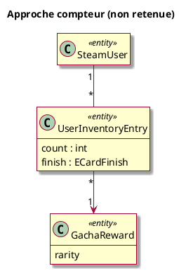

Cette approche est simple, mais elle pose un problème dès qu'on veut traiter chaque carte comme un **objet
individuel** : comment vendre *une* carte spécifique sur le marché si plusieurs exemplaires sont regroupés dans un
compteur ? Comment savoir laquelle est dans le deck ?

J'ai donc retenu une approche **copie physique** : chaque tirage crée une ligne distincte dans
`steam_user_gacha_reward`. Chaque `UserGachaReward` a son propre identifiant, ce qui permet de le référencer
individuellement dans le deck et sur le marché.

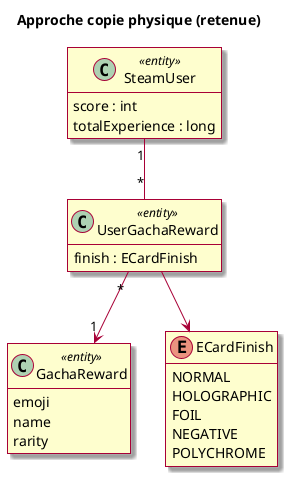

- Le coût est une volumétrie plus importante en bdd, mais acceptable au regard du périmètre du projet.
- Je privilégie la mutation directe de l'état plutôt qu'une approche **event sourcing** (stocker des événements
  `CarteTirée`, `CarteVendue`...).

---

## 6. Cas d'utilisation

### 6.1. Rappel : modèle de données

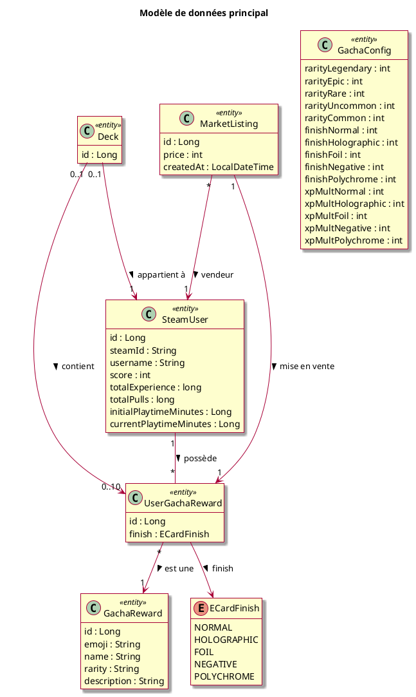

### 6.2. Sous-domaine : système gacha

#### 6.2.1. Tirer des cartes

Le joueur dépense 10 points de score (💧) par tirage (1 à 10 tirages par requête). Le système tire aléatoirement une
rareté puis une finition, selon les probabilités configurées dans `GachaConfig`. Une ligne `UserGachaReward` est
créée pour chaque carte obtenue.

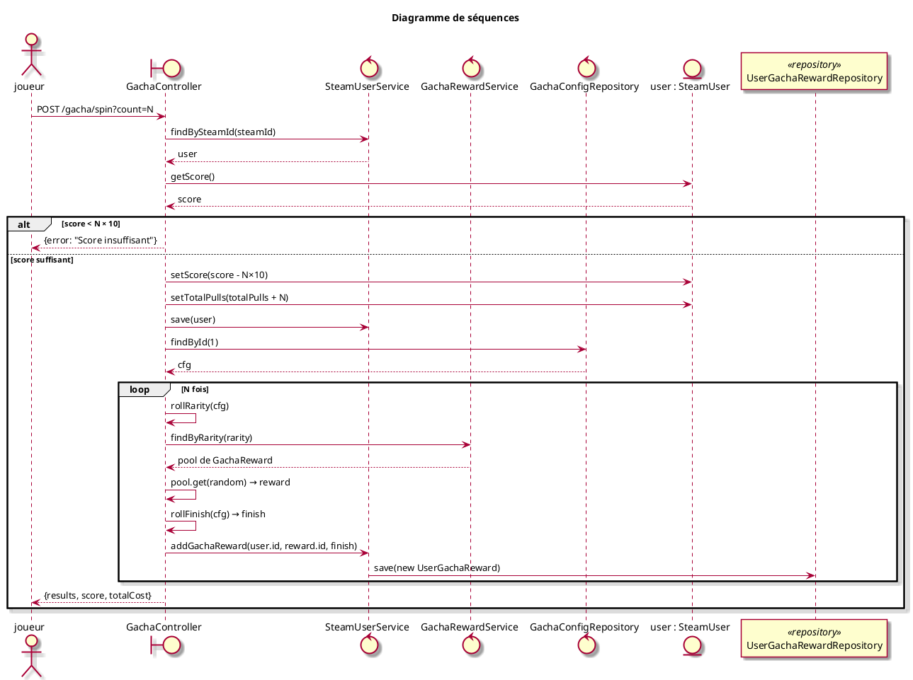

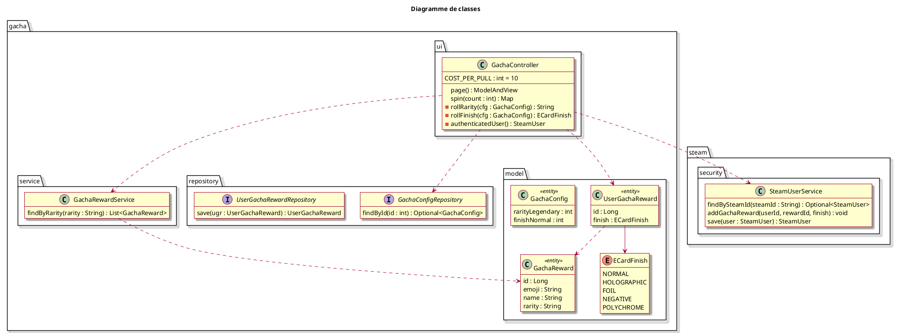

#### 6.2.2. Convertir des cartes en XP

Le joueur sélectionne des cartes depuis son inventaire et les convertit en XP via un drag & drop vers la "Steam
Machine". La requête POST transmet la liste des cartes à convertir `(rewardId, finish)`. Chaque `UserGachaReward`
correspondant est supprimé et son XP équivalente est créditée sur le joueur. Les cartes en vente sur le marché et
celles dans le deck sont automatiquement exclues.

Le calcul d'XP suit la formule : `XP = base_rareté × multiplicateur_finish` (simple, efficace.)

| Rareté    | Base XP | Finish      | Multiplicateur |
|-----------|---------|-------------|----------------|
| Common    | 10      | NORMAL      | ×1             |
| Uncommon  | 25      | HOLOGRAPHIC | ×2             |
| Rare      | 75      | FOIL        | ×3             |
| Epic      | 200     | NEGATIVE    | ×4             |
| Legendary | 500     | POLYCHROME  | ×5             |

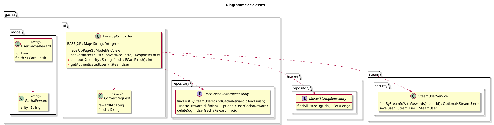

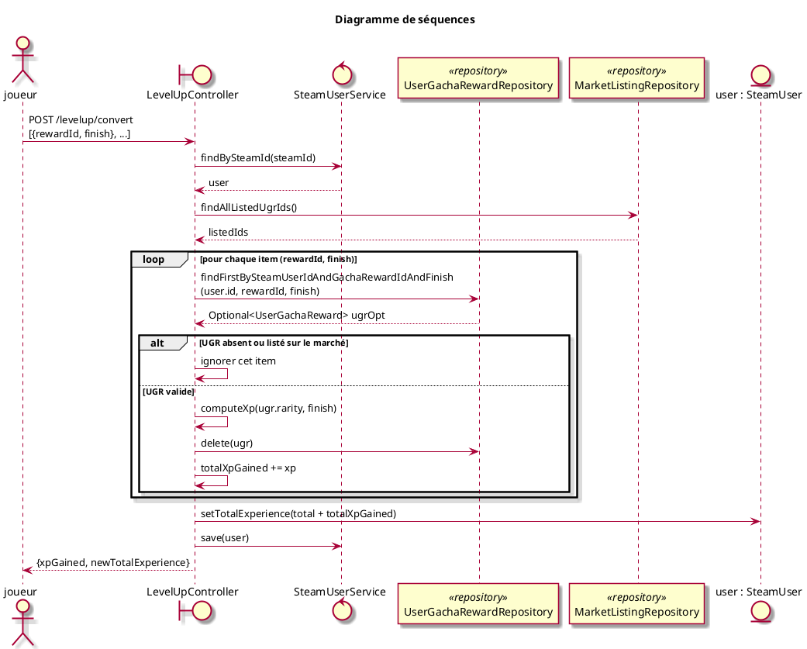

### 6.3. Sous-domaine : marché entre joueurs

#### 6.3.1. Mettre une carte en vente

Le joueur sélectionne une carte de son inventaire et fixe un prix en points de score (💧).

- Deux protections s'appliquent : la carte doit appartenir au vendeur, et elle ne doit pas être présente dans son deck.
  Si les conditions sont remplies, une `MarketListing` est créée, la carte reste physiquement dans l'inventaire du
  vendeur mais est filtrée partout jusqu'à la vente ou l'annulation.

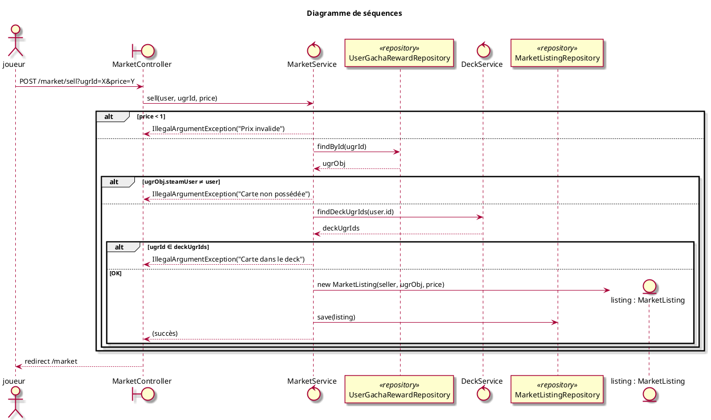

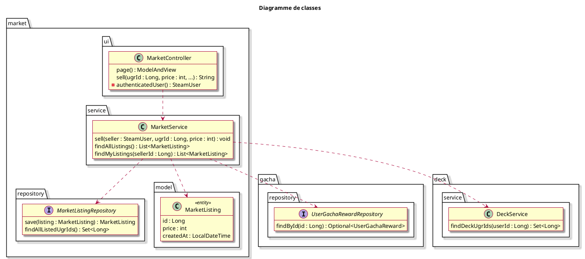

#### 6.3.2. Acheter une carte

L'acheteur clique sur une annonce disponible. Le service vérifie qu'il dispose du score suffisant, puis effectue le
transfert : le score est débité de l'acheteur et crédité au vendeur, et la propriété de la `UserGachaReward` est
transférée. L'annonce est ensuite supprimée.

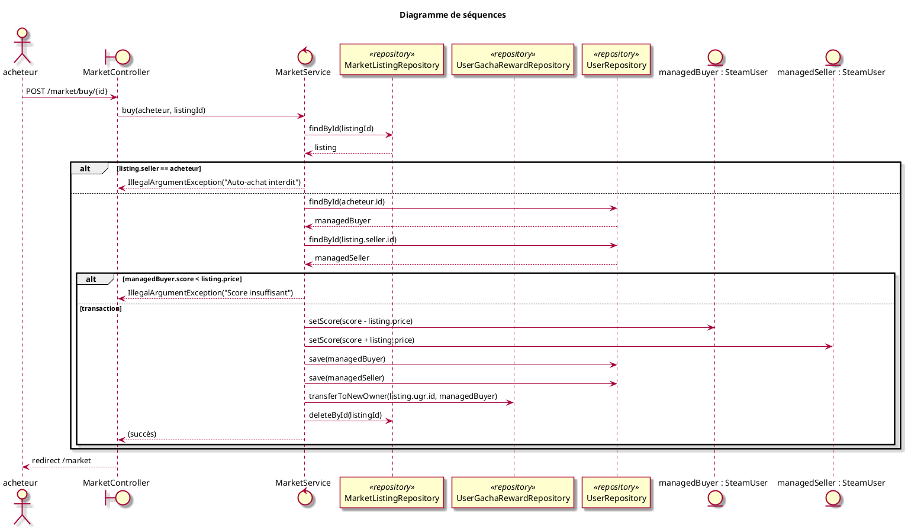

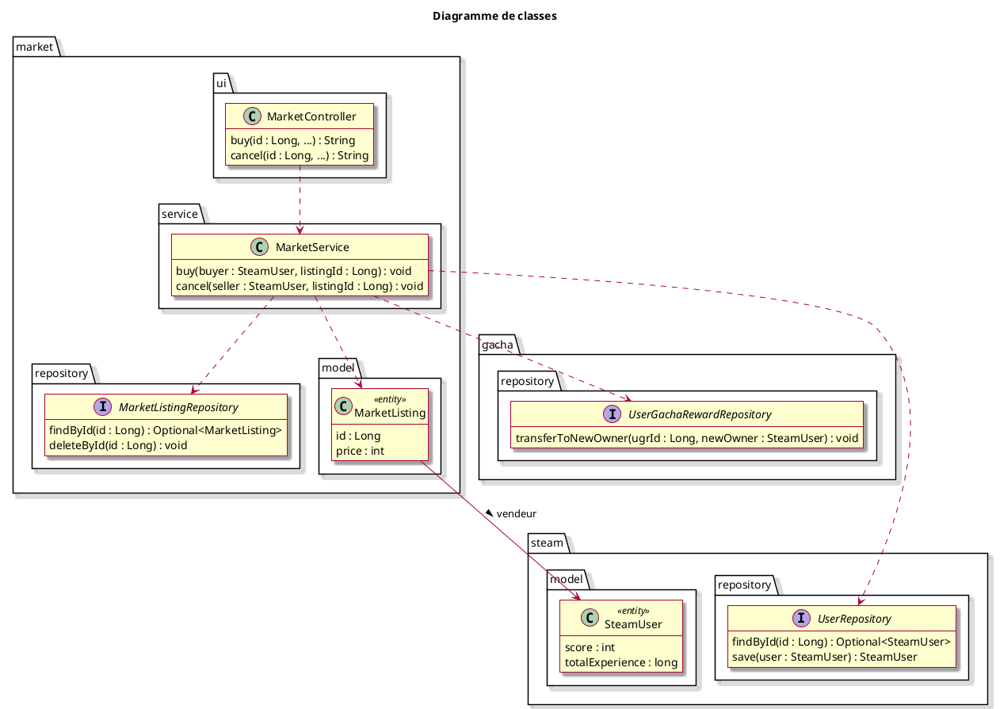

---

## 7. Regroupement des classes

### 7.1. Groupe domaine Steam

Entités et services liés à l'identité des joueurs. Ce groupe est transverse : tous les autres modules en dépendent.

- `SteamUser`, entité principale du joueur (score, XP, temps de jeu)
- `SteamUserService`, façade CRUD et requêtes spécialisées
- `UserRepository`, accès JPA avec requêtes personnalisées (classements, transfert UGR)
- `SteamOpenIdAuthenticationFilter`, réception de l'assertion OpenID 2.0 au retour de Steam
- `SteamAuthenticationProvider`, vérification de l'assertion auprès de Steam et enregistrement de la connexion

### 7.2. Groupe gacha

Coeur fonctionnel de l'application. Ce groupe produit des `UserGachaReward` qui sont ensuite consommés par les
modules `deck` et `market`.

- `GachaReward`, modèle de carte (emoji, nom, rareté, description)
- `UserGachaReward`, copie physique d'une carte appartenant à un joueur
- `ECardFinish`, finition de la carte (effet visuel + multiplicateur XP)
- `GachaConfig`, paramètres de probabilités des rarités et finitions
- `GachaController`, tirage (GET page, POST `/gacha/spin`)
- `LevelUpController`, conversion de cartes en XP (GET page, POST `/levelup/convert`)
- `InventoryController`, affichage de l'inventaire

### 7.3. Groupe marché

Gère les échanges de cartes entre joueurs. Ce groupe dépend du groupe gacha (pour les `UserGachaReward`) et du
groupe deck (pour la protection des cartes en deck).

- `MarketListing`, annonce de vente (vendeur, UGR, prix, date)
- `MarketService`, logique métier des transactions (vente, achat, annulation)
- `MarketController`, routes `/market/*`

### 7.4. Groupe interface utilisateur

Composants transverses d'affichage.

- `SteamUserModelAdvice`, `@ControllerAdvice` qui injecte `steamUser` et `currentScore` dans tous les modèles
- `HomeController`, page d'accueil
- `LeaderboardController`, classements par temps de jeu et par XP
- `LegalController`, mentions légales

---

## 8. Choix et remarques

### 8.1. Isolation des sessions admin et Steam

L'application devra gérer deux contextes de sécurité coexistant dans la même session HTTP, un contexte admin et
un contexte Steam. Un appel naïf à `session.invalidate()` lors de la déconnexion Steam détruirait également la
session admin active.

Il faudra donc n'effacer que l'attribut de contexte Steam, sans invalider la session HTTP globale. Cette
contrainte d'implémentation doit être documentée, car pas évidente.

En pratique, la déconnexion Steam utilise le mécanisme standard de Spring Security (`.logout()` de la chaîne
principale) configuré avec `invalidateHttpSession(false)` : le `SecurityContextLogoutHandler` retire alors seulement
le contexte stocké sous la clé de la chaîne principale. La connexion suit elle aussi le schéma standard : un filtre d'authentification
(`SteamOpenIdAuthenticationFilter`) transmet l'assertion OpenID au `SteamAuthenticationProvider`, qui la fait vérifier
par Steam.

### 8.2. Gestion des associations paresseuses (LazyInit)

Les associations `@OneToMany` et `@ManyToOne` seront configurées en `FetchType.LAZY` pour éviter de charger
inutilement toutes les cartes d'un joueur à chaque requête. Cela expose à des `LazyInitializationException` si on
accède aux associations hors contexte de transaction.

Deux stratégies envisagées :

- un `@EntityGraph` sur les requêtes qui ont besoin de l'association `gachaReward` en même temps que l'UGR, pour
  éviter le problème N+1 ;
- un `JOIN FETCH` explicite (requête JPQL dédiée) pour les cas où l'inventaire complet doit être chargé, comme
  l'affichage de la page marché.

### 8.3. Protection des cartes dans le deck

Une carte présente dans le deck d'un joueur ne devra pas pouvoir être vendue sur le marché ni convertie en XP. Cette
protection sera gérée au niveau de la couche service, `MarketService` consultera `DeckService` avant d'autoriser
une mise en vente, et non pas par une contrainte de base de données.

Avantage : la logique est centralisée et lisible. Inconvénient : si un autre point d'entrée venait à contourner le
service, la protection ne serait plus garantie.

- Dans une architecture plus robuste, on pourrait envisager une contrainte applicative via un état explicite sur
  `UserGachaReward` (ex: champ `inDeck : boolean`).
- Ou carrément un State Machine pour gérer les différents états possibles d'une carte (disponible, dans le deck, listée
  sur le marché, etc.) mais cela serait probablement overkill pour ce projet.

### 8.4. Limites du modèle et points d'attention

- La logique de tirage aléatoire (calcul de rareté et de finition) sera placée dans `GachaController` pour
  simplifier. Pour un code plus testable, elle devrait à terme migrer dans un composant ou service
  dédié.
- La conversion de cartes en XP pourrait bénéficier d'une couche service dédiée (`LevelUpService`) plutôt que
  d'accéder directement aux repositories depuis le contrôleur. Cela faciliterait la réutilisation et les tests.
- Le module `leaderboard` ne contient qu'un contrôleur, sans service ni repository propres : il délègue
  directement à `SteamUserService` pour récupérer les classements. Ce choix est justifié, le leaderboard n'a
  pas de domaine propre, c'est uniquement une vue triée des données `SteamUser`. En contrepartie, `SteamUserService`
  accumule des responsabilités (gestion des utilisateurs, gacha, classements), ce qui nuit à sa cohésion. Une
  alternative serait d'extraire les requêtes de classement dans un `LeaderboardService` dédié, au prix d'une
  indirection supplémentaire.

---

## 9. Annexes

### 9.1. Terminologie

| Terme       | Définition                                                                                                                                          |
|-------------|-----------------------------------------------------------------------------------------------------------------------------------------------------|
| **UGR**     | `UserGachaReward`, copie physique d'une carte appartenant à un joueur                                                                               |
| **Score**   | Monnaie interne de Bruine (💧), gagnée via les connexions Steam et le temps de jeu                                                                  |
| **Finish**  | Finition d'une carte (effet visuel) : Normal, Holographique, Foil, Négatif, Polychrome                                                              |
| **Rareté**  | Niveau de rareté d'une carte : Common, Uncommon, Rare, Epic, Legendary                                                                              |
| **Deck**    | Sélection de 10 cartes maximum exposées sur le profil public du joueur                                                                              |
| **Listing** | Annonce de vente d'une carte sur le marché (`MarketListing`)                                                                                        |
| **XP**      | Expérience cumulée via la conversion de cartes (`totalExperience`)                                                                                  |
| **steamId** | Identifiant unique Steam au format `7656119XXXXXXXXXX` (17 chiffres)                                                                                |
| **BOM**     | (Bill of Materials) en Java est un fichier qui centralise les versions des dépendances pour garantir leur compatibilité et simplifier leur gestion. |
| **cfg**     | Abréviation de `GachaConfig`, entité qui stocke les paramètres de probabilités du système gacha.                                                    |