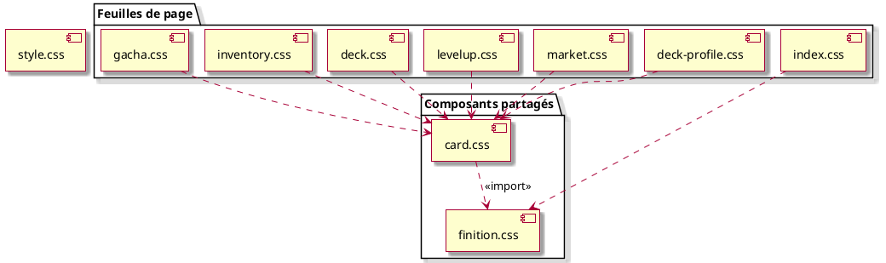

```plantuml
@startuml css_dependances
!pragma layout smetana
skin rose

component "style.css" as style

package "Composants partagés" as partages {
  component "card.css" as card
  component "finition.css" as finition

  card ..> finition : <<import>>
}

package "Feuilles de page" as pages {
  component "index.css" as index
  component "gacha.css" as gacha
  component "inventory.css" as inventory
  component "deck.css" as deck
  component "levelup.css" as levelup
  component "market.css" as market
  component "deck-profile.css" as widget
}

gacha     ..> card
inventory ..> card
deck      ..> card
levelup   ..> card
market    ..> card
widget    ..> card
index     ..> finition

@enduml
```
